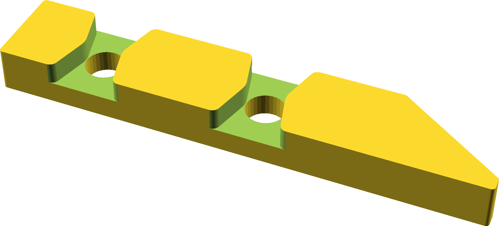

## Tiny Woodworking Clamp

This is based on [Ollari's video](https://www.youtube.com/watch?v=d2sReIba6L0)
showing manually-made tiny clamps.  Sized for M6 or 1/4-20 thread 10mm
dia cross-nuts 20mm long (which are about $0.50 each, and you need 4x).

This should scale down if you make your own smaller cross-nuts.

