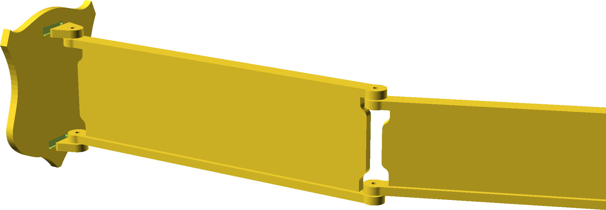

## Dust Pipe Tail

While there are several designs around essentially a jib crane for holding a
dust collection duct for a cnc table, this is an attempt at making a horizontal
scorpion tail for the same purpose.

Status: untested.

TODO: Figure out how the duct mounts (probably some kind of hook underneath)

