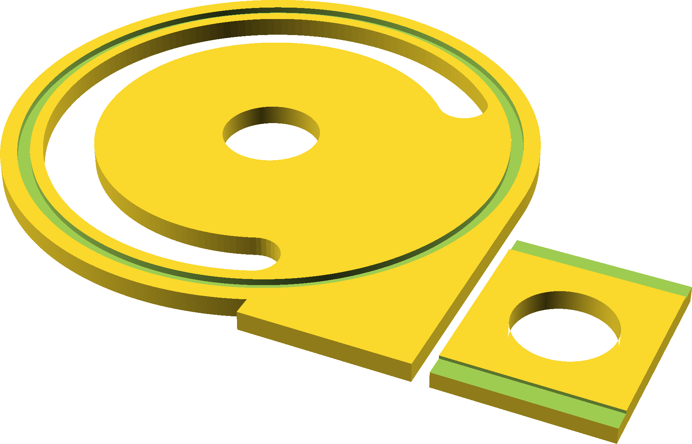

# Bucket Separator

This is a basic chip seprator tht could be the beginning of a Thein baffle.
Ports sized for a shop vac hose and straight extension, with  the little  groove
being for the top of a 5-gallon bucket.

