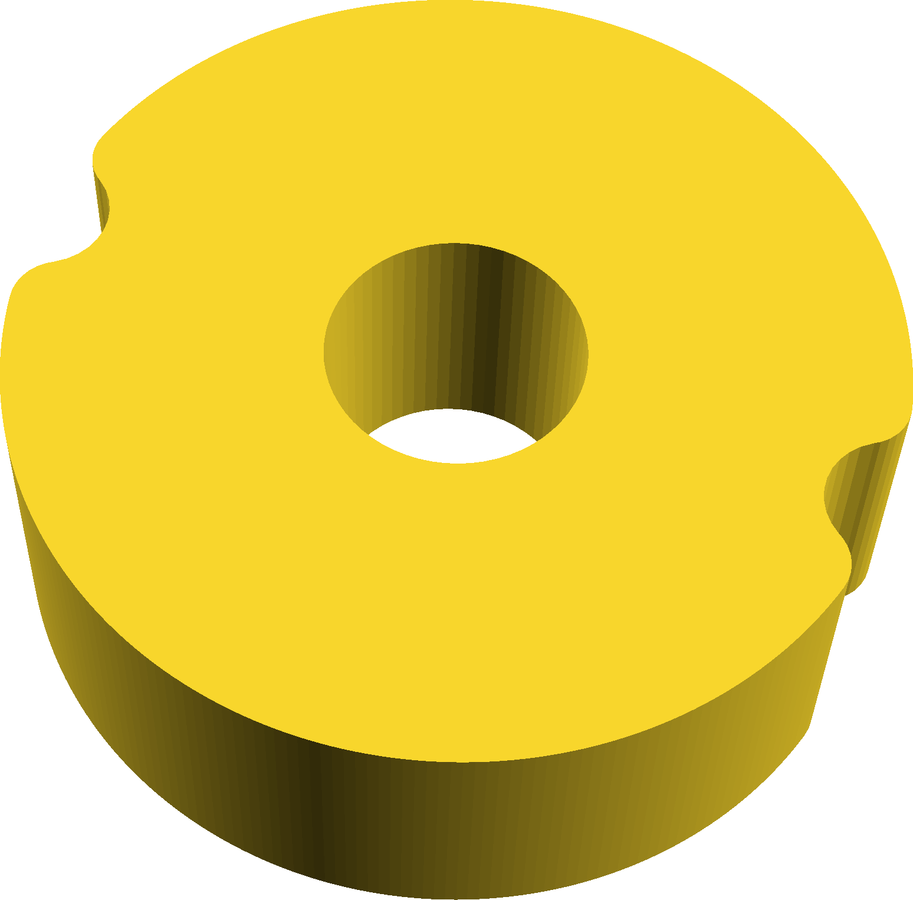

# Detent Knob

Inspired by Jeremy Schmidt's table saw fence knob:
https://www.youtube.com/watch?v=4pudkvHFOfk

You can include an arbitrary nuber of detents, but the ability for it to snap
to nice values when moving the fence by hand comes from the thread pitch, not
number of detents.

