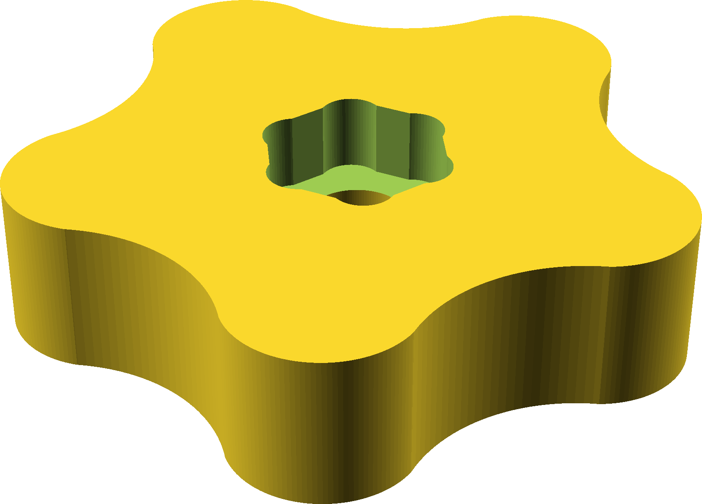

## Knob

This is a 5-pointed knob to use on a hex bolt or nut, similar to the ones that
[Marius Hornberger seems to like](https://www.youtube.com/watch?v=_HMneS7nrsE).

The inner hex is filleted so you don't need to square up the corners with a
chisel -- a nut should just press in.

