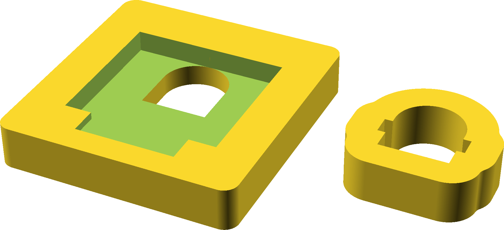

## Battery mount

This is intended as a bulkhead mount for fitting 18V Ryobi batteries to ride-on
toys.

If you use 18mm plywood, you need one of the large part, and two of the small
part.  The large part needs an additional notch that I have not included, but
it's easy enough to file in.  Glue the sandwich together trying to keep the
battery path as smooth as possible.

I had difficulty finding good spring terminals that would handle the
current.  (With kids driving, we only blow a 20A fuse when stalled; as a
cross-check [Ryobi Batt
Rebuild](http://toolboyworld.com/eBay/Ryobi_Batt_Rebuild.htm) says the P103 is
rated for 13A.)  I ended up repurposing the contacts found in some pcb-mount
18650 holders and soldering the 12ga wire directly to them.

I then hot glued the contacts in place, which has worked fine so far, but I
don't live where it's super hot.

