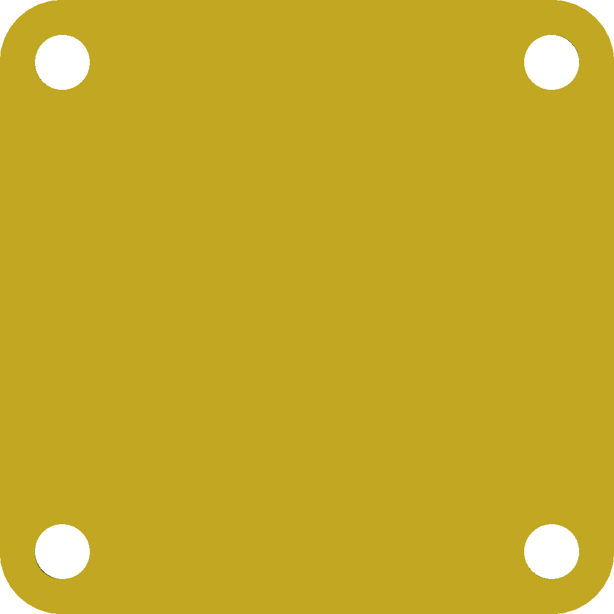

## Squareness Pins

Use this to cut round holes that match dowel pins you have on hand.  Then
measure their diagonals, which should be equal.

If you don't have dowel pins larger than your smallest cutter handy, check
`squareness_semicircles` alongside this.

