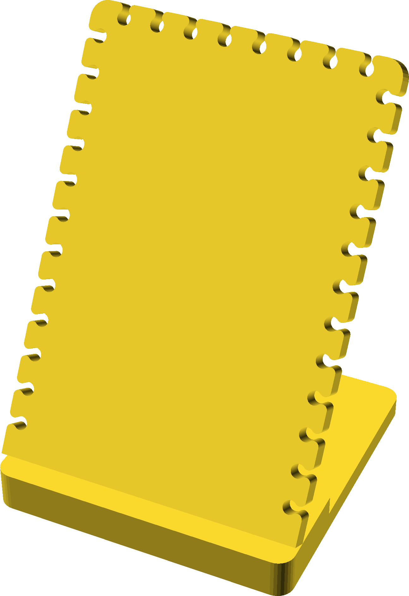

## Holder for necklaces

A request for display at shows.  You can put necklaces in the slots at top, or
route the chain through opposing slots and use a clip at the back.

The part called base2 is glued on top of base1 after drilling for hinge screws.
I then used a forstner bit and some shock cord in a hollow dowel to make a
collpsable brace.

