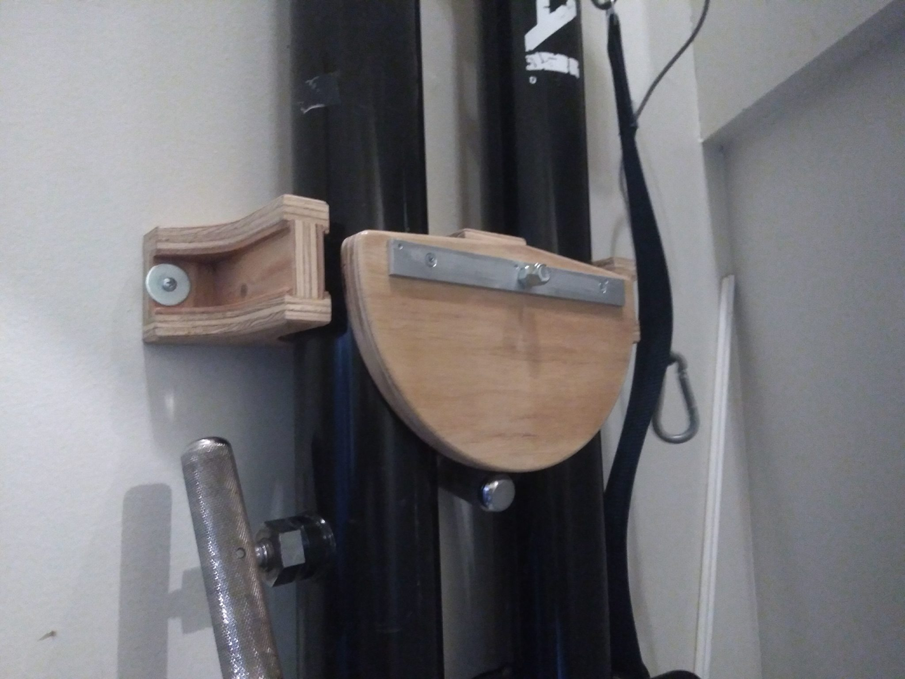

# Volleyball Pole Rack

This holds two volleyball poles upright for storage.  In addition to the 16mm
plywood, you need:

* 4x sturdy screws/anchors for wall mounting
* 5/16" x 6" carriage bolt
* 2x nuts (I used one nylock, and still jammed them)
* 1x fender washer
* 1x stiffening bar (adjust spinner pocket to match)
* 2x flat head screws (countersink holes in stiffening bar)
* glue and screws to taste (finish head ones work nicely)

## Steps

1. Cut one set of the plates plus one spinner.
2. Use forstner bit to create a recess in the back for the bolt head (or cnc
   with another setup, not included here).
3. Glue/screw main piece together, using long bolt for alignment.
4. Countersink holes in stiffener, tap gently into spinner.  Drill 5/16" hole
   using routed hole as a template.
5. Sand/finish (I used 3 coats of polycrylic)
6. Mount to studs if possible, otherwise use very strong drywall anchors.
